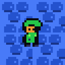
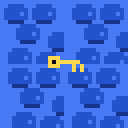
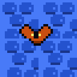
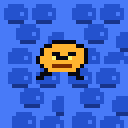

# Game Content Reference

This page documents the gameplay content currently implemented by `nesylink`.
It is meant to help map authors and task authors understand what can be placed
in a room today.

## Player Character

The player is a Zelda-like dungeon adventurer with these default properties:

| Render | Property | Current behavior |
|---|---|---|
|  | Facing down | Default front-facing sprite. |
|  | Facing sideways | Used after horizontal movement. |
|  | Facing up | Used after upward movement. |

| Property | Current behavior |
|---|---|
| Position | Spawned from the room `default_spawn` entry, or from an exit entry when changing rooms. |
| Health | Starts with the default player HP from `core/constants.py`; traps and monsters reduce it. |
| Gold | Starts at zero and increases from gold chests or defeated monsters. |
| Keys | Starts at zero and is increased by key chests. Locked exits may consume keys. |
| Inventory | Starts with `sword` and `shield`. |
| Slot A | Defaults to `sword`; also opens adjacent chests and talks to adjacent NPCs before swinging. |
| Slot B | Defaults to `shield`. |

Supported actions are wait, four-direction movement, slot A, and slot B. The
player faces the last movement direction, and the sword hitbox is one tile in
front of that facing direction.

## Items And Interactables

Objects are placed through room JSON under `objects`. Supported object kinds are
`chest`, `monster`, `trap`, `button`, and `npc`.

| Render | Kind | Important fields | Function |
|---|---|---|---|
|  | `chest` | `loot` | Blocks movement until opened. Slot A opens an adjacent unopened chest and applies its loot. |
|  | `trap` | `damage`, `respawn_to`, `single_use` | Damages the player on contact. If the player survives, they are moved to the configured spawn. |
|  | `button` | `message` | Pressed by standing on it. Can satisfy a conditional exit requirement. |
|  | `npc` | `text` | Blocks movement. Slot A next to it shows the NPC message. |
|  | `monster` | `monster_type`, `hp`, `damage` | Moving enemy. Contact damages the player unless the shield is active. |

Chest loot currently supports:

| Render | Loot kind | Fields | Effect |
|---|---|---|---|
|  | `key` | `amount`, `key_id` | Adds one or more keys and emits `key_collected`. `key_id` is metadata for authors. |
|  | `gold` | `amount` | Adds gold and emits `gold_collected`. |
|  | `heal` | `amount` | Restores health up to max health and emits `agent_healed`. |
|  | `item` | `item_id` | Adds an item name to inventory and emits `item_collected`. |

Equipment currently implemented:

| Render | Item | How it works |
|---|---|---|
|  | `sword` | Slot use creates a one-tile melee hitbox in the facing direction. Each hit removes 1 monster HP, applies knockback, stuns the monster, and kills it at 0 HP. |
|  | `shield` | Slot use raises the shield for a short action window. Contact with a monster during the active block prevents damage, knocks the monster back, and stuns it. |

## Monsters

All monsters have `hp`, `damage`, a tile position, pixel movement, stun frames,
and contact damage. Sword hits and shield blocks both knock monsters back and
stun them. A killed monster grants the fixed monster kill gold reward and emits
`monster_killed`.

| Render | Monster type | Traits | Defeat method |
|---|---|---|---|
|  | `chaser` | Always moves toward the player, avoiding walls and blocking tiles. | Hit with the sword until HP reaches 0. Shield can block contact damage but does not reduce HP. |
|  | `patroller` | Moves around a square patrol route derived from `patrol_span`. | Time sword attacks around the patrol path; each sword hit removes 1 HP. |
|  | `ambusher` | Stays inactive until the player enters `ambush_range`, then chases. | Trigger or avoid the ambush range, then defeat with repeated sword hits. |

Example monster:

```json
{
  "id": "monster_1",
  "kind": "monster",
  "pos": [7, 4],
  "monster_type": "chaser",
  "hp": 2,
  "damage": 1
}
```

## Map Tiles And Observation Codes

Room layouts are 10 columns by 8 rows. The JSON `layout` supports only these
characters:

| Character | Meaning |
|---|---|
| `.` | Floor. |
| `#` | Wall. Blocks player and monster movement. |

The structured observation `obs["grid"]` uses numeric codes:

| Code | Meaning |
|---:|---|
| 0 | Empty floor |
| 1 | Wall |
| 2 | Player |
| 3 | Monster |
| 4 | Closed chest |
| 5 | Exit tile |
| 6 | Active trap |
| 7 | Button |
| 8 | NPC |

Object rendering and the observation grid are derived from room state, not from
extra layout characters.

## Exits And Requirements

Exit directions are `north`, `south`, `west`, and `east`. Each direction maps
to a fixed two-tile doorway shape on the room edge.

| Exit type | Requirement behavior |
|---|---|
| `normal` | Always usable. |
| `locked_key` | Requires `key_count` keys and may consume them with `consume_key: true`. |
| `conditional` | May require a pressed button, an inventory item, all monsters defeated, and/or a key count. |

Set `complete_task: true` when reaching the exit should emit
`environment_completed` and end the episode as `world_completed`.

## Built-in Maps

| Map id | Main content | Objective shape |
|---|---|---|
| `key_door` | One key chest and one locked north exit. | Open the chest, collect the key, use the locked exit. |
| `kill_monsters` | Trap borders, one key chest, one chaser, one conditional west exit. | Defeat the monster, collect the key, use the exit. |
| `avoid_traps` | Maze-like walls, three traps, north and south exits. | Navigate to the exit while avoiding trap damage. |
| `dungeon` / `prototype` | Four rooms with gold, key, heal chest, button gate, locked key gate, NPCs, traps, and all monster types. | Exploration and mechanics demonstration map. |

## Authoring Notes

Use JSON maps for world content and Python tasks for training intent. A new task
usually combines:

- a `map_id` or `map_path`
- a `reward_id` or custom `reward_module`
- `max_steps`, `action_repeat`, and mission text

See `docs/reference/tasks-and-validators.md` for the task registry contract and
`docs/guides/map-creation.md` for room JSON examples.
